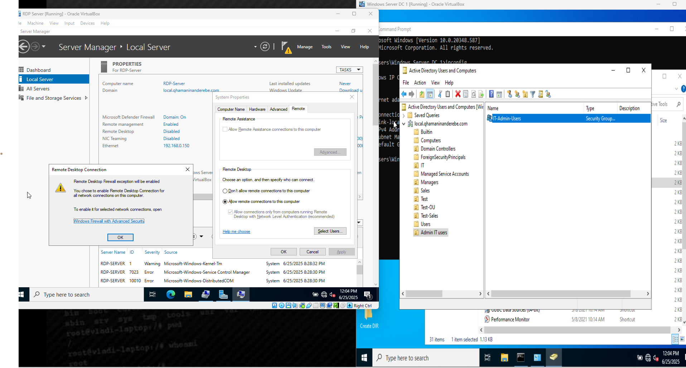
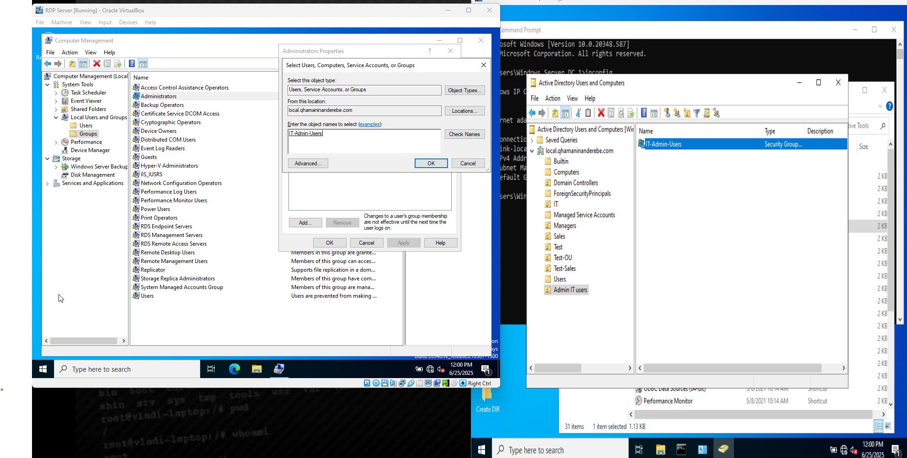
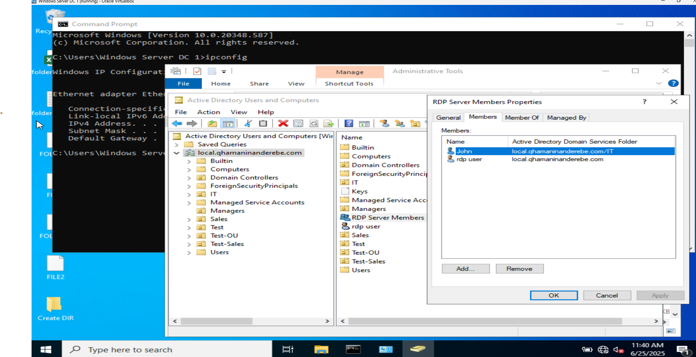
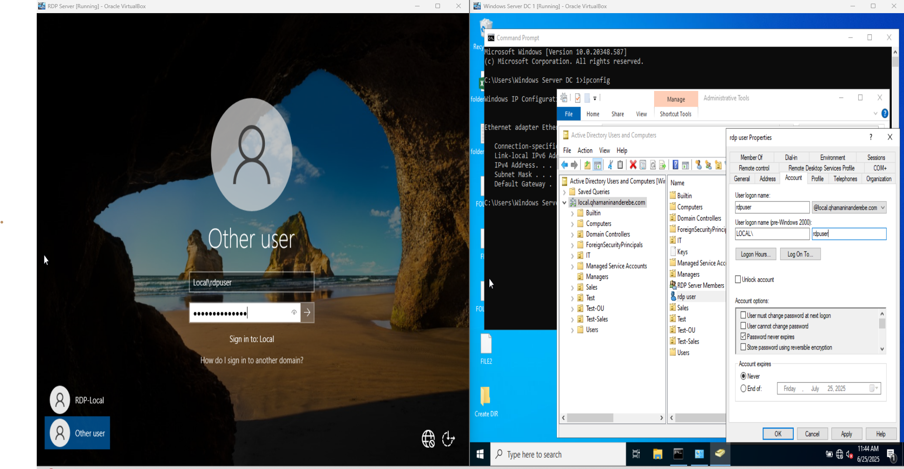
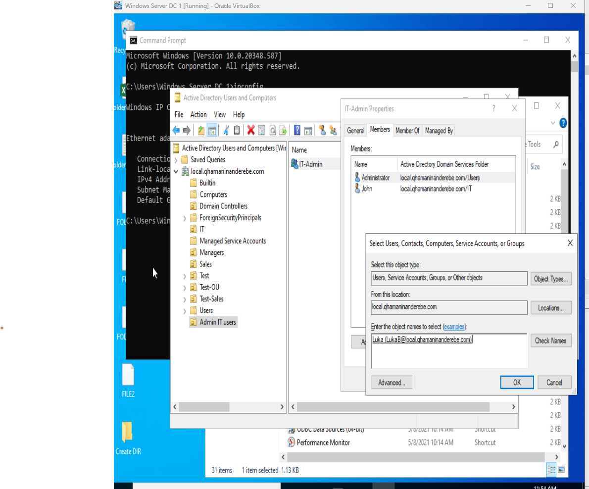
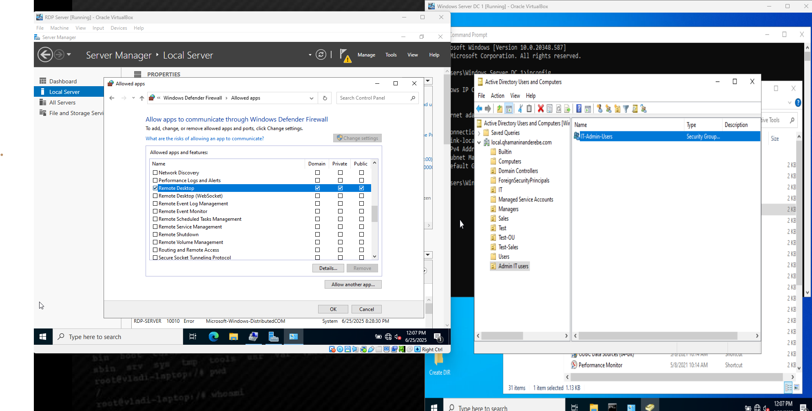
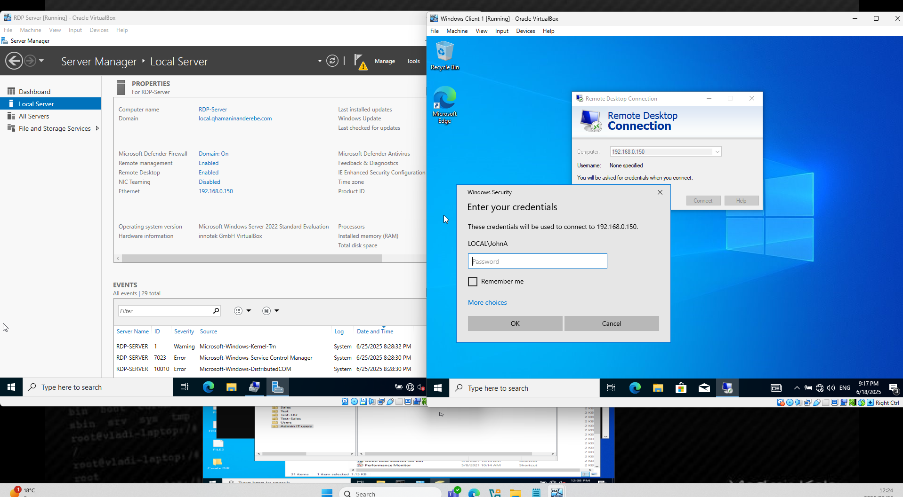
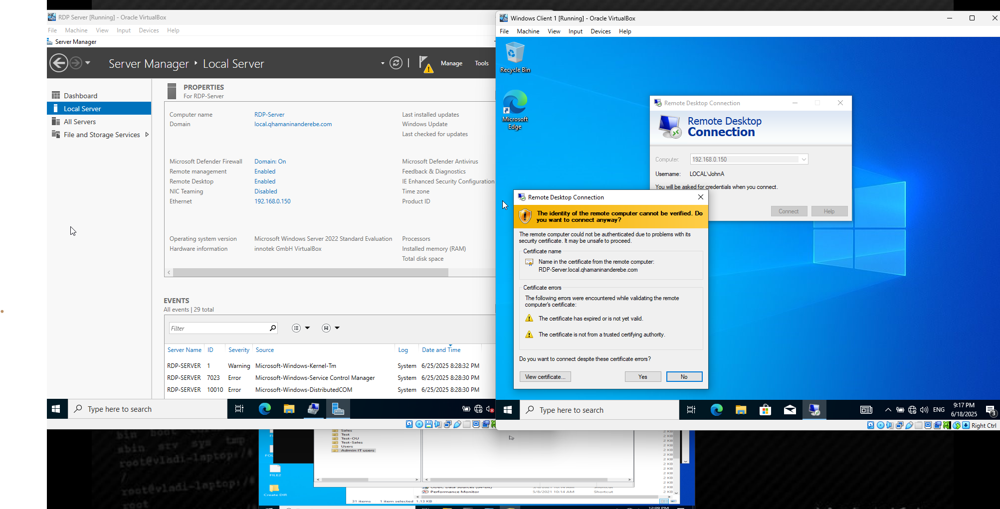
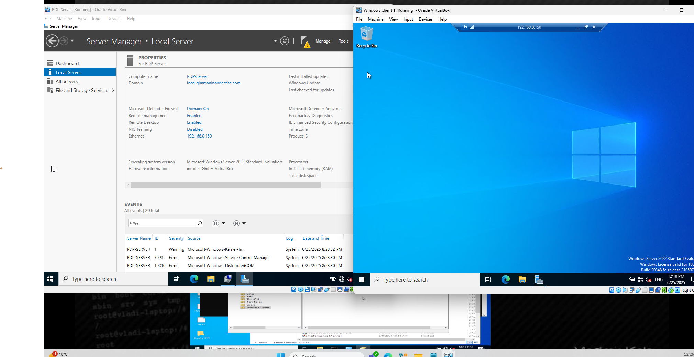
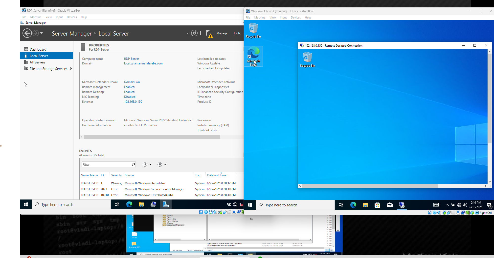

# windows-rdp-server-setup-lab
Lab demonstrating the configuration of a Windows RDP Server using a dedicated VM, AD group membership, and RDP role installation via Server Manager.

# 🖥️ Windows RDP Server Setup Lab

This lab demonstrates how to configure a Windows Server as a Remote Desktop Protocol (RDP) host, allowing users to connect remotely using domain credentials through a secure Active Directory setup.

---

## 🎯 Lab Objective

- Set up a **dedicated RDP Server VM**.
- Create and configure an **admin user and security group** (`IT-Admin`).
- **Install Remote Desktop Services (RDS)** roles on the server.
- **Remotely connect** to the RDP server from a domain-joined client using IP-based connection.

---

## 🛠️ Key Components

- Windows Server 2022 VM as RDP Host
- Client Windows VM for testing RDP connection
- Active Directory, Organizational Units, and Security Group (`IT-Admin`)
- Server Manager for role installation

---

## 📸 Screenshots Walkthrough

| Step | Description | Screenshot |
|------|-------------|------------|
| 1️⃣ | Created `rdpadmin` user and added to `IT-Admin` security group. |  |
| 2️⃣ | Confirmed `IT-Admin` group is added to the **Administrators group**. |  |
| 3️⃣ | Signed into RDP VM as `rdpadmin` domain user. |  |
| 4️⃣ | Installed **Remote Desktop Services role** via Server Manager. |  |
| 5️⃣ | Role added successfully – server now acts as RDP host. |  |
| 6️⃣ | Confirmed RDP service is running and accessible. |  |
| 7️⃣ | Connected to RDP host from client VM using IP address. |  |
| 8️⃣ | RDP authentication prompt appeared – entered domain creds. |  |
| 9️⃣ | Successfully logged in remotely. |  |
| 🔟 | Admin user now accessing desktop via RDP session. |  |

---

## 🧠 Concepts Demonstrated

- Remote Desktop Services configuration
- Role-based access and Active Directory integration
- Secure RDP setup using internal IP
- Group-based admin access using AD Security Groups

---

## 📎 Use Case

This type of setup is common in enterprise environments where IT admins require remote access to servers or internal workstations for management and troubleshooting.

---

## 💬 Coming Soon

- GPO-based RDP access control  
- PowerShell-based user RDP provisioning  
- RDP session monitoring with audit policies  

---

## 🙌 Author

**Qhamaninande Rebe**  
🔗 Sharing labs and real-world IT demos.  
📍 Connect with me on [LinkedIn](https://www.linkedin.com) | More labs on [GitHub](https://github.com/netplus-labs)
